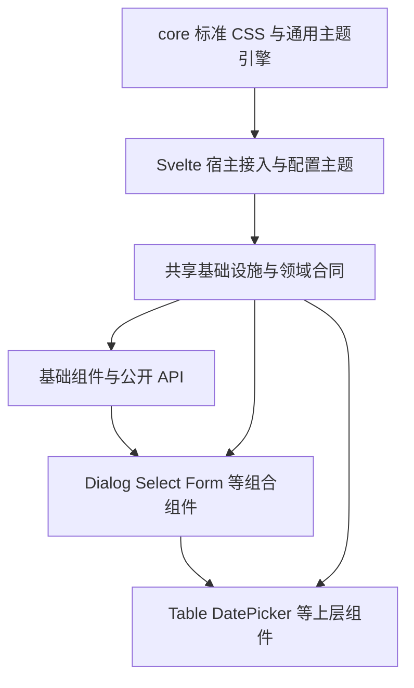

# Svelte 生产架构、基础设施与组件规划

已确认：共享响应式模型可直接修改；Lucide 组件直传；Field 独立负责 label/help/error，Input/Select 等专注控件本身；Dialog 为完整组件；五档使用 xs/sm/md/lg/xl；标准 CSS 与通用主题引擎留 core，UI 预设与默认主题 css 在 svelte；Button 使用 color + variant + size，Select 默认返回整条选项数据，集中默认配置与统一浮层管理。业务组件尚未实施，本文明确区分已经确认的边界与后续建议。

作者侧偏好已更新：专用样式直接写在模板，类型按需内联/复用，默认值只写在 $props() 解构；配置接入可由编译器生成。上层复用底层 Props 和嵌套 slotProps，不强制 ControlAppearance 或另一套组件定义语法。第 8 节记录这些约定及待验证边界；第 16 节是待评审的具体组件目录，不能视为已实现或已全部批准发布。

## 1. 包与默认值边界

| @zui/core                                        | @zui/svelte                                |
| ------------------------------------------------ | ------------------------------------------ |
| 标准属性/关键字/单位、生成器、样式 runtime       | lightTheme/darkTheme、五档尺度、语义 Token |
| defineTheme/extendTheme/overrideTheme/ThemeScope | DefaultTokens、带内置主题类型的 css        |
| 空 baseTheme、纯 CSS 的 css、createCss           | Svelte 默认宿主、SSR、Provider、后续组件   |

core 不导入 svelte。core.createRuntime() 默认 baseTheme；Svelte 自动宿主和 renderStyled/createStyleHandle 默认 lightTheme。显式 core runtime 需要传 theme: lightTheme 或自定义主题；显式自定义配置不能静默补 UI 键。自定义主题继续用 core.createCss(theme)，无需全局 TS 模块扩展。

```ts
import { css, lightTheme, darkTheme } from '@zui/svelte';
import { createCss, createRuntime, extendTheme, ThemeScope } from '@zui/core';
const appTheme = extendTheme(lightTheme, { color: { brand: '#0f766e' } });
const appCss = createCss(appTheme);
```

## 2. 共享模型与原生双向绑定

```svelte
<script lang="ts">
  const form = $state({ name: '', enabled: true, editing: false });
  function reset() {
    form.name = '';
    form.enabled = true;
  }
</script>

<Field label="名称"><Input bind:value={form.name} /></Field>
<Checkbox bind:checked={form.enabled}>启用</Checkbox>
<Dialog bind:open={form.editing} title="编辑资料">
  <Input bind:value={form.name} />
  <Button onclick={reset}>重置</Button>
</Dialog>
```

组件和业务代码持有同一响应式模型即可直接修改，数组也可 push/splice；不强制 setter、reducer、不可变更新或 value/defaultValue 双模式。事件是可选通知，不是同步数据的必经入口。

可复用模型由 .svelte.ts 的普通工厂返回 $state，在页面/请求内创建，再通过 props/context 共享；不创建跨 SSR 请求的可变单例。普通裸 JS 对象不会自动变响应式。

```ts
// form.svelte.ts：先在变量声明中建立状态，再返回共享代理。
export function createForm() {
  const form = $state({ name: '', editing: false });
  return form;
}
```

$state 是编译语法，不能在普通 .ts 中随意调用，也不能直接 return $state(...)。业务拿到 form 后，普通 TS 函数可以直接修改它的字段；这不需要把所有业务文件都改成 runes 文件。

建议允许 undefined 初值，展示为空而不在挂载时回写。内部 $bindable 不为这些字段设置非 undefined fallback。原生 defaultValue/defaultChecked 的 form.reset 合同另行保留。原生事件遵循 Svelte 顺序；可选语义通知在内部写入后发出，外部赋值不伪造用户事件。

## 3. Field 与控件分离，校验方案待选

```svelte
<Field label="邮箱" help="用于接收通知" error={errors.email}>
  <Input type="email" icon={Mail} clearable bind:value={form.email} />
</Field>
```

用户已决定保留公开 Field，并把标题、帮助和错误移出 Input。这替代早期一体 Input 方案，不再同时维护两套同义入口。Input 可以独立用在搜索栏/工具栏；需要字段展示时外包 Field。Dialog 等完整交互组件的方向不变。

职责：Field 负责 label/help/error、字段身份、描述/错误 ID、invalid 与表单关联；Input 负责原生输入、图标/清空/密码、IME/光标等编辑行为；Form 负责注册、校验调度、提交与 reset。Field 不持有第二份业务值，也不要求各控件继承通用基类。不同时公开职责相同的 Field 和 FieldFrame。

Field.class/style 控制字段容器，slotProps.label/help/error 定制展示；Input.class/style 控制输入控件根，slotProps.input/clearButton 等面向真实输入元素与按钮。原生 id/name/autocomplete/输入事件仍由 Input 转发到 input，不能挂到外壳。上层 Field 不需要经多层 slotProps 才能控制输入框，直接给子 Input 传参即可。

ZUI 控件通过薄字段上下文接入 ID、aria-describedby/invalid 与焦点注册；一个 Field 默认一个主控件。多输入组合要有明确组语义，不能重复使用同一个 input ID；任意原生元素/第三方编辑器需显式 ID 或接入协议，不靠查询 DOM 猜控件。label/help 可用 string 或 snippet，error 支持消息展示；required 与 schema 规则的关系必须明确，不从复杂 schema 内部结构猜测必填。

```svelte
<Field label="负责人" error={errors.owner}>
  <Select bind:value={form.owner} options={users} />
</Field>
<Field label="预算" error={errors.budget}>
  <NumberInput bind:value={form.budget} />
</Field>
```

这些控件不复制字段展示。Input 的文本类型范围明确，number/checkbox/file 不塞进一个巨型 type 分支。Checkbox/Radio 的选项文字属于控件内容，可以保留；整组标题、帮助和错误属于外部 Field，必要时使用 fieldset/legend 语义。

### 校验选择：先用同一表单示例比较，不先安装或锁库

用户允许绑定成熟实现或自行实现，但要求先看代码再选择。候选：

| 方案                      | 作者写法                                                               | 成本与取舍                                                                                                          |
| ------------------------- | ---------------------------------------------------------------------- | ------------------------------------------------------------------------------------------------------------------- |
| Zod 4（当前推荐，未确认） | z.string().min(2, '至少两个字')；object/refine；z.input/z.output       | 链式易读，规则/类型成熟；实际打包和类型开销需测量，不能引用旧 Zod 的体积结论                                        |
| Valibot                   | v.pipe(v.string(), v.minLength(2, '至少两个字'))；partialCheck/forward | 模块化、可细粒度裁剪；对象与跨字段规则通常更多函数嵌套                                                              |
| 普通校验函数              | 接收模型、返回字段错误                                                 | 简单规则最直接；模型类型、格式规则、路径、组合、输入/输出转换逐渐需要自行维护，不应再自造 required/min/max 规则 DSL |
| 原生约束                  | required/minlength/type 与 ValidityState                               | 适合基础 HTML 语义，不能单独覆盖对象选择、跨字段和远端校验；不和统一 Field 错误叠加两套提示                         |

建议规则与类型交给选定库，ZUI 自行承担表单协调；不引入另一套强制 store 的完整表单框架。若主要做黑盒校验，可用 StandardSchemaV1 作为内部类型/调用协议，直接接收 schema，不要求业务写 adapter/factory，也不维护插件注册体系。先验收一种规则库，其余兼容性另测；用户尚未选择。Standard Schema 不统一 required 提取、字段依赖、取消信号或每次调用的库专属 locale 配置，不能假装这些自动具备。

同一业务场景的候选写法：名称至少 2 个字符，密码至少 8 个字符，两次密码一致；不因选择 schema 库改变 Field/Input 的结构。

```ts
// 方案 A：Zod 4
import * as z from 'zod';
const schema = z
  .object({
    name: z.string().min(2, '名称至少 2 个字符'),
    password: z.string().min(8, '密码至少 8 个字符'),
    confirmPassword: z.string(),
  })
  .refine((value) => value.password === value.confirmPassword, {
    message: '两次密码不一致',
    path: ['confirmPassword'],
  });
```

```ts
// 方案 B：Valibot
import * as v from 'valibot';
const schema = v.pipe(
  v.object({
    name: v.pipe(v.string(), v.minLength(2, '名称至少 2 个字符')),
    password: v.pipe(v.string(), v.minLength(8, '密码至少 8 个字符')),
    confirmPassword: v.string(),
  }),
  v.forward(
    v.partialCheck(
      [['password'], ['confirmPassword']],
      (value) => value.password === value.confirmPassword,
      '两次密码不一致',
    ),
    ['confirmPassword'],
  ),
);
```

```ts
// 方案 C：普通函数；model 是业务的 $state，返回形态仍为 API 候选。
function validate(value: typeof model) {
  return {
    name: value.name.length >= 2 ? undefined : '名称至少 2 个字符',
    password: value.password.length >= 8 ? undefined : '密码至少 8 个字符',
    confirmPassword: value.password === value.confirmPassword ? undefined : '两次密码不一致',
  };
}
```

这三段表达同一基本业务意图，不承诺各库所有 Unicode 长度/非法类型/异步细节完全相同。统一的长度单位与跨字段执行时机须在选型验收中确定。普通函数方案用 validate 替代 schema，不默认同时叠加两套重复规则。

候选使用形态为 Form bind:value={model} schema={schema} onvalid={save}，内部仍是同一份业务 $state；Field name 只关联错误路径/注册，Input 显式 bind:value，不用编译器从 name 猜取值和赋值表达式。onvalid 接收校验输出；onsubmit 保留原生事件语义。API 名称和无 schema 时的普通函数入口尚未冻结。

生产合同必须包含：

- 初始不展示整表错误；建议首次 blur 后校验，触达字段修改时重新校验，submit 验证完整模型。IME 组合过程不扰动输入，异步重校验可防抖；校验执行范围与错误展示范围分开。
- 跨字段规则在整体 schema 中表达，不能只截取单字段 schema 后宣称联动完整；库的 refine/partialCheck 执行条件需用“不相关字段非法”的用例验证。原地修改/程序赋值也使结果失效，但不伪造用户 touched/DOM 事件。
- 每次异步运行关联模型版本，reset/卸载/新值后旧结果不回写。支持 signal 的业务请求才可实际 Abort；schema Promise 无通用取消能力，至少忽略过期结果，不能声称全部请求已取消。
- 提交使用一致版本的完整数据；异步校验期间修改则不把过期结果交给保存。input/output 分开，trim/coerce/default/transform 的输出用于提交，不自动回填控件或替换原对象选项引用。异步业务异常是提交/系统错误，不伪装成字段不合法。
- 错误保留路径和来源；字段错误/表单错误/服务端错误分开。数组移位、卸载字段、重置、首错聚焦、SSR/i18n 是正式验收项；不使用每请求修改全局校验库 locale 的方式。
- Field.name 不会从父 Form 泛型自动得到路径补全。简单场景明确这一限制；需要强路径类型时复用标准 TS 或少量显式路径能力，不把复杂递归泛型强加给所有字段。

依据：[Zod 基础与输入输出](https://zod.dev/basics)、[Zod 库接入建议](https://zod.dev/library-authors)、[Zod Mini](https://zod.dev/packages/mini)、[Valibot 介绍](https://valibot.dev/guides/introduction/)、[Valibot partialCheck](https://valibot.dev/api/partialCheck/)、[Valibot 标准协议与限制](https://valibot.dev/guides/integrate-valibot/)。这些是选型依据，尚未执行实际 schema 依赖的安装、类型或运行时验收。

## 4. Lucide 与内容

```svelte
<script lang="ts">
  import { Save, ArrowRight } from '@lucide/svelte';
</script>

<Button icon={Save}>保存</Button>
<Button icon={ArrowRight} iconPosition="end">下一步</Button>
```

icon 接收 LucideIcon，尺寸随 size，颜色继承 currentColor；特殊属性用 slotProps.icon。内部图标也使用 Lucide，不再提供字符串注册表。复杂金额单位、徽标等内容用 leading/trailing snippet，同位置 snippet 优先。纯图标按钮要有 aria-label，装饰图标不重复朗读。

## 5. Button：已确认 color + variant + size

核对的成熟接口：MUI 使用 color/variant/size；Ant Design 支持 color + variant，type 只是组合快捷方式且存在优先级；Chakra 使用 colorPalette 与 variant。吸收“语义颜色、表现方式、尺寸、行为状态分开”，不照搬 recipe 系统、React 状态或多个重复快捷入口。

字段组合已确认；具体颜色/变体取值、默认值和行为细节仍按下表讨论：

```svelte
<Button color="primary" variant="solid" size="md" icon={Save}>保存</Button>
<Button color="danger" variant="outline">删除</Button>
<Button color="success" variant="soft">已完成</Button>
<Button color="neutral" variant="text">取消</Button>
<Button color="primary" variant="link">查看详情</Button>
```

| 维度              | 建议                                        | 含义                                                 |
| ----------------- | ------------------------------------------- | ---------------------------------------------------- |
| color             | neutral/primary/success/warning/danger/info | 业务语义；六种不是大小档位，不强凑五个               |
| variant           | solid/soft/outline/text/link                | 实色/柔和底/描边/文字按钮/链接外观；每个都可搭配颜色 |
| size              | xs/sm/md/lg/xl，默认 md                     | 控件高、字号、图标、间距的协同映射                   |
| radius            | none/xs/sm/md/lg/xl/full                    | 外形；不与 size 混为同一个枚举                       |
| block             | boolean                                     | 占满可用行宽；不使用 size="full" 混淆高度和宽度      |
| loading、disabled | boolean                                     | 独立行为状态，不充当颜色或 variant                   |
| type              | button/submit/reset                         | 原生含义，默认 button；不新增 htmlType 别名          |

建议默认 neutral + solid + md；正常 hover/active/focus-visible/disabled/loading 由内部状态规则组合，不提供 defaultPressed/hovered 等成组状态参数。link 仅表示外观，不偷偷改变 button 语义；真实导航组件是否独立在后续决定。

color 相比前稿 tone 更接近成熟库，但不要同时保留 color/tone/type 三个表达相同语义的入口。当前配色已有主色和反馈色实色配对；更多 soft/hover 角色需明确派生还是新增 Token，不机械批量扩展颜色键。

参考：[MUI Button](https://mui.com/material-ui/react-button/)、[Ant Design Button](https://ant.design/components/button)、[Chakra Button](https://chakra-ui.com/docs/components/button)。这只是方案依据，ZUI API 尚未实现。

## 6. Select：已确认默认返回整条选项数据

```svelte
<Select
  label="负责人"
  options={users}
  getKey={(user) => user.id}
  getLabel={(user) => user.name}
  bind:value={form.owner}
/>
```

选中李四后，form.owner 就是用户传入的那条选项，可以直接读 email 或编辑字段；不会自动请求选项中原本不存在的数据。多选对应选项数组。组件不主动深克隆、不以替换数组引用作为唯一更新信号。

“返回对象”和“识别对象”分开：value 保存项目，getKey 提供稳定 string/number 身份，用于匹配、键盘活动项、重载及 keyed each；getLabel 提供可搜索/朗读的文字，视觉内容可以另用 snippet。需要稳定键，但不要求业务绑定 ID。getKey/getLabel 是否对固定标准形状提供默认值仍待确定，不自动猜多个字段名。

后台重新加载同 ID 的新对象时仍匹配选中项，但不偷偷替换 form.owner，避免覆盖编辑。业务可明确赋新对象或归并数据；选中项暂时不在搜索结果/当前页也不能自动清空。对象字段要跨多个位置联动，应共享同一 $state 代理；普通原始 JSON 对象并不会因为一处被代理就自动同步所有原始引用。

### 建议推翻旧 valueMode 方案：保持一个值模型

默认已是整项，建议删除前稿的 valueMode="item" 和 getValue，先不在 Select 里维护“对象/ID”两条写入路径。只保存 ID 的少数场景可以使用 Svelte 原生函数绑定：

```svelte
<Select
  options={users}
  getKey={(user) => user.id}
  getLabel={(user) => user.name}
  bind:value={
    () => users.find((user) => user.id === form.ownerId) ?? null,
    (user) => (form.ownerId = user?.id ?? null)
  }
/>
```

普通使用者无需写 getter/setter；这里只是边界适配。该例要求本地列表完整，远程分页时应从业务实体缓存查询，不假装当前页包含所有已选数据。若 ID 适配将来高频使用，可以增加薄包装或业务辅助函数，不先增加平行可写 selectedItem。此项精简是新建议，尚未批准实施。

Naive UI 的基础 value 常用编号、回调另带 option；Ant Design labelInValue 是 {value,label}，不是完整业务对象；Element Plus 明确支持对象值与 value-key。我们吸收身份/内容分离，默认值形态以用户已确认的整项为准，不再以这些库的默认值约束 ZUI。

清空值建议单选 null、多选 []，允许 undefined 初值但不在挂载时改写；是否统一 null 仍待确认。默认对象模式下提交原生表单的序列化需要独立合同：建议 name 提交 getKey(value)，不能产生 [object Object]，与 JS 绑定的对象保持区别。

参考：[Svelte 函数绑定](https://svelte.dev/docs/svelte/bind#Function-bindings)、[Element Plus](https://element-plus.org/en-US/component/select)、[Naive UI](https://github.com/tusen-ai/naive-ui/blob/main/src/select/demos/enUS/index.demo-entry.md)、[Ant Design](https://ant.design/components/select)。

## 7. 五档是尺度原则，不是所有参数都必须五个

已落地的 UI 预设在 svelte/src/theme.ts，见 [主题尺度与迁移](../svelte/README.md#主题尺度与迁移)。core 只保留通用引擎及空基础主题。

- spacing、duration、shadow：五档 + none。
- radius：五档 + none + full。
- fontSize、breakpoint：五档，不提供无意义的 none/full。
- size：control 与 icon 两组五档，另有 none/full；control/icon 作为默认角色引用。
- borderWidth：五档 + none，thin/focus 是角色引用。
- opacity：五档 + none/full，disabled 是角色引用；opacity=0 不等于禁用或从布局移除。
- lineHeight、letterSpacing：五档，保留 normal/tight 等合理角色。
- fontWeight 保留 light/normal/medium/semibold/bold；fontFamily/easing/color/zIndex 以语义职责为主。

组件 size=md 表示中等规模，不表示所有属性都取自己的 md：字号、行高、控件高要协调。size.full 的 CSS 值为 100%，不等于所有组件都有 size="full"。Dialog 可另有五档内容宽度及明确 fullscreen 行为；不能把按钮高度与弹窗宽度共用同一数列。

## 8. 组合、样式和接入

### 作者形态：原生语法、就近实现

- 组件专用样式直接写在模板 class={css((s) => { ... })}；局部 if/switch、尺寸映射和常量默认留在同一 .svelte 文件。不为文件短而增加 buttonClass/applyVariant/BaseButton/组件工厂。
- 普通 TS 函数和专项基础设施承担真实共享责任；公共数据只有在多个消费者确实语义一致时才提取。Dialog.size 表示内容宽度，不能自动转发为关闭按钮的 size。
- 原生属性来自 svelte/elements；包装组件使用 ComponentProps<typeof Component>。优先内联类型，较长或被复用时再命名；Size/Radius/Color 等基础联合类型按需集中，不强制 ControlAppearance 或万能 BaseProps。
- 用 Pick/Omit/Partial 和普通交叉类型即可。& 不会覆盖同名属性，替换定义先 Omit；不一律 Partial 子组件 Props 来抹掉必选关系。slotProps 引用实际元素/组件类型，不使用 Record<string, any>。

```svelte
<script lang="ts">
  import type { HTMLButtonAttributes } from 'svelte/elements';
  import type { Size } from './types';

  let {
    size = 'md',
    block = false,
    loading = false,
    children,
    ...rest
  }: HTMLButtonAttributes & {
    size?: Size;
    block?: boolean;
    loading?: boolean;
  } = $props();
</script>
```

这是声明形态示意，不是删减后的生产 Button。默认值只在解构中写一次，不额外维护 ButtonDefaults/fallback/definition 对象。外部需要命名类型可用 ComponentProps<typeof Button>，发布时须验证声明产物保留完整补全。

### 默认配置接入：编译补代码，运行时读作用域

作者形态已选定；以下转换方案待 A0/A1 实现。对明确登记的字段，生成等价代码：

```ts
// 自动生成；不修改 Svelte 编译器，不要求组件作者维护。
const __config = readComponentConfig('Button');
let { size = __config.size ?? 'md', block = __config.block ?? false, loading = false } = $props();
```

__config 是在初始化时捕获上下文的读取视图，不是配置快照。实例明确值优先；undefined 继承；false/none 是有效值。默认表达式保留原求值位置，不在构建时执行用户函数，不用 effect 复制状态。配置字段不接受 null 时应由类型和开发诊断拒绝，而非增加含糊的清空语义。

- 必须明确可配置字段，不能把所有有默认值的属性都自动纳入。候选是一份构建清单，如 Button: ['color', 'variant', 'size', 'radius', 'block']；只列键，不重复默认值/类型。清单载体与第三方组件登记入口仍待讨论。
- 使用 AST 和真实导入/源码身份，生成名称避冲突、source map、重复转换标记和清楚的错误。不按文件 basename/运行时函数名猜组件身份，不替换任意业务 $props。
- 配置类型从真实 Props 与字段清单产生普通 Pick 等声明；TS 错误必须回指原文件。复杂泛型、别名、动态声明不可可靠处理时显式诊断，不丢类型或静默跳过。
- $bindable 的 value/open/checked 不自动走视觉默认配置；保留原生双向绑定和请求内业务状态。
- 开发、SSR、发布使用同一转换。当前 Vite class 插件会跳过 node_modules，因此库发布前必须完成所需预处理；独立安装包验证不能依赖工作区恰好扫描到源码。配置转换与现有 CSS 编译桥分别明确顺序、幂等和协议兼容。

当前证据：锁定 Svelte 5.57.0 下，内联类型与上述转换前/后的小样本均通过 client/server 编译；原生 lazy fallback 的探针验证了配置变化、显式覆盖、恢复 undefined 和 false。不是完整 ConfigProvider、DOM 响应、声明生成或发布验收；配置转换尚未落地。

### slotProps：继承类型、原样转发、有限合并

class/style 控制公开根，slotProps 转发稳定职责位置；内容使用 snippet，重复项可按实际需要使用类型化回调。Dialog 保持完整组件，不要求使用者拼 Root/Overlay/Content。公开根要明确，例如 Dialog 的可见内容容器，不将 Portal 占位当作样式目标。

纯包装组件直接继承 ComponentProps 并转发 rest，原有 slotProps/children/事件/attachment 自然保留；需要双向绑定时显式 $bindable + bind:value，spread 不会建立双向绑定。上层组合示例：

```ts
slotProps?: {
  body?: HTMLAttributes<HTMLDivElement>;
  closeButton?: Omit<ComponentProps<typeof Button>, 'children' | 'type'>;
};
```

Dialog.slotProps.closeButton 接收 Button 参数，并保留 closeButton.slotProps.icon 等底层能力；不重新抄一份按钮颜色/尺寸/图标类型。上层只消费自己的位置，新增 badge 等位置需从转发对象分离。公开位置属于稳定 API，不暴露 header.actions.wrapper 等整棵 DOM 树；高频业务参数放顶层 Props，不用深层路径承担 title/error/value。

| 内容           | 合并/所有权合同                                                                                                                              |
| -------------- | -------------------------------------------------------------------------------------------------------------------------------------------- |
| 普通可覆盖属性 | 内部位置默认 → 配置覆盖 → 实例覆盖；undefined 不抹掉前值。上层没特殊要求时继续给底层 undefined，保留底层配置继承                             |
| class/style    | class 全保留、style 遵循原生声明能力；不按 class 数组顺序保证 CSS 优先级，不用按分号拆分的自制解析器                                         |
| 嵌套 slotProps | 只对已定义的 slotProps 结构逐位置合并；普通 options/item/Date 等数据保留完整值，不做通用深合并                                               |
| 状态与语义     | value/checked、内部关联 ID/ARIA、按钮 type 等由对应组件负责；类型排除和最终运行时赋值都需保证，不能仅信 TS                                   |
| 业务事件       | 明确执行顺序、取消与异常行为；例如外部 onclick 后检查 defaultPrevented 再 requestClose。不能取消必要清理；显式调用外部事件后不再自动串联一次 |
| attachment     | 保留可枚举 Symbol 与目标节点身份、清理生命周期；仅 Object.keys/entries 的工具不完整，不能把子节点 attachment 挂到根                          |

有限编译增强可为已登记 slot 的消费位置生成 class/style/slotProps 合并，作者保留普通 spread；原生 Svelte spread 本身只按覆盖规则工作。不得改写所有业务 spread、猜测事件语义、在纯包装中反复合并同一份 Button 配置。无编译增强的业务包装若主动添加定制，可显式调用同一个小型合并工具；不能维护两套规则。

层序建议 zui.components → zui.defaults → zui.app，需统一自动 CSR、显式 runtime、SSR 与模块样式；详细覆盖边界见第 14 节。现有 class 编译器已识别 slotProps/CSS 传递，但没有完整的通用 slot 合并实现。

验收须覆盖多层包装/嵌套 slot 的类型正负例、透传/覆盖/undefined、符号 attachment、事件只执行一次、属性移除、共享同一 slot 对象给多实例、响应式重赋值与数组变更、CSP/SSR/hydration 和底层组件独立发布。不能因为小样本可编译就宣称这些全部通过。

## 9. 集中默认配置：已确认方向，入口暂名 ConfigProvider

```svelte
<ConfigProvider size="md" radius="sm" locale={zhCN}>
  <Field label="名称"><Input bind:value={form.name} /></Field>
  <Button>继承默认尺寸</Button>
  <Button size="lg">局部大按钮</Button>
  <ConfigProvider size="sm">
    <Field label="紧凑区域"><Input bind:value={form.code} /></Field>
  </ConfigProvider>
</ConfigProvider>
```

优先级建议：组件显式 prop > 最近 Provider 对应字段 > 上级 Provider > 库默认值。内层只改 size 时，radius/locale 仍实时继承；undefined 表示继承，none 是实际圆角值，不能混淆。配置可来自 $state，业务直接修改它就能更新继承者。

Provider 默认只提供逻辑上下文，不为配置新增布局 DOM；即使不写 Provider，组件也可使用库默认值。locale 负责清空/关闭/暂无数据等库内文字，业务 label/help 仍由应用提供；不另造完整 i18n 框架。dir、日期/数字格式及组件专属默认值的范围后续细化。

主题仍由 ThemeScope 和已有 StyleProvider 输出 CSS 变量，ConfigProvider 不再增加 themeOverrides/colorMode 等平行状态。若以后提供一个更短的组合入口，也只组合已有能力，不产生第二个主题控制器。

这套全局默认值不能改变业务模型，例如切换 locale 不重写 value，改 size 不清空选中项。SSR 每个应用/请求有自己的配置，不能使用共享可变模块单例。

## 10. 统一浮层管理：已确认方向，规则建议

统一处理 Dialog/Drawer/Popover/Select 等的父子归属、挂载、焦点、关闭与资源清理。它与 CSS @layer 是两回事，也不等于给每个组件分配一个固定 z-index。

```text
应用
└─ Dialog
   └─ Select 下拉框
      └─ 子菜单或提示
```

| 操作/责任                      | 默认建议                                                                           |
| ------------------------------ | ---------------------------------------------------------------------------------- |
| Select 在 Dialog 中展开        | 注册为 Dialog 子层，挂到所属弹窗的浮层容器，不盲目丢到 body                        |
| Escape                         | 先关最上面的可关闭层；关 Select 后再按一次才关 Dialog；IME 组合输入中不抢 Escape   |
| 点击 Dialog 内容但在 Select 外 | 关闭 Select，Dialog 保持                                                           |
| 点击 Select 的 Portal 内容     | 仍算 Dialog 内部交互，不能误触发父层 outside                                       |
| 明确点击 Dialog 遮罩           | 只有允许遮罩关闭时才关 Dialog，同时释放其子层；同一事件不重复派发多次关闭          |
| 焦点范围                       | 模态 Dialog 的焦点范围包含注册的子浮层，不把 Select 的焦点拉走                     |
| 恢复焦点                       | 关 Select 回触发点；关 Dialog 回原入口；入口已移除或已打开新模态层时不能强行抢焦点 |
| 滚动锁与背景不可交互           | 按实际模态层持有数量管理，关内层不能提前解锁外层                                   |
| 退出动画                       | 关闭请求与物理移除分开处理，避免穿透点击、提前放开焦点或泄漏资源                   |
| 主题/配置                      | Portal 保留逻辑配置，并显式继承/绑定同一 ThemeScope；不能因为 DOM 搬家丢主题变量   |
| CSP/SSR                        | 定位和滚动补偿沿用已有样式通道；SSR 不碰 document，不产生跨请求可变层列表          |

层管理是 svelte 内部的小型服务，先不做公开的万能 LayerManager 类。组件自己处理业务状态，管理器负责栈、归属与清理。多应用根在同一 Document 时要协调焦点和模态锁；ShadowRoot 的宿主与样式目标要明确。若使用原生顶层弹窗能力，挂载策略必须随之验证，不能假设调高 z-index 就够了。

## 11. Svelte 原生能力：必须先用，再考虑自建

本次核对官方文档和仓库锁定的 Svelte 5.57.0。createContext 的本机类型/实现确实返回 get/set/has；下列能力以锁定版本为基线，不只根据最新版网页假定可用。

| 能力                                   | ZUI 应省掉的代码                                                  | 必须保留的边界                                                                               |
| -------------------------------------- | ----------------------------------------------------------------- | -------------------------------------------------------------------------------------------- |
| $state 深层代理、.svelte.ts            | 业务 store 包装、强制不可变复制、组件专用 model 类                | 普通对象/数组自动代理；class 实例不自动深代理，跨模块重赋值和原始对象引用有边界              |
| $bindable + bind:value/open            | 两套受控/非受控状态、手写父子同步事件链                           | 少量真实业务状态可绑定；不开放每个内部缓存为可写 prop，允许 undefined 时不制造 fallback 冲突 |
| $derived / $derived.by                 | $effect 中复制 props、手维护 label/过滤列表/选中键镜像            | 派生保持纯计算；不要用可覆盖 derived 偷造另一套 value 状态                                   |
| 函数绑定                               | 为偶尔的 ID 映射再增加 valueMode/getValue/returnObject 组合       | 普通对象绑定无需 getter，只有边界适配使用；异步数据仍需明确来源                              |
| snippet / children                     | renderLabel/renderOption/slot 三套并行接口、额外展示组件          | snippet 替换内容，关键 option/label 壳及无障碍关系仍由组件维护                               |
| $props / 原生 HTML 属性类型 / generics | 逐个重写原生属性、表单对象转 any、万能基类 Props                  | 泛型联系 options/value/snippet；单选与多选的类型区别要验证                                   |
| $props.id()                            | 自建全局递增 ID、SSR 两端随机 ID                                  | 用户 id 优先，label/help/error 引用要一致，多根按宿主规则隔离                                |
| createContext                          | 新 UI 配置中的字符串 key 注册表、无意义 Provider 工厂             | 在组件初始化时取得上下文，事件中使用已捕获的引用；继承必须保持响应性                         |
| bind:this + export function            | 每个控件的 ref 管理器、React 式 imperative handle 包装            | 只暴露 focus/select/blur 等少量实际方法，组件引用不是 DOM 引用                               |
| @attach / createAttachmentKey          | 为 observer、定位或 DOM 集成新增 actions 数组/inputRef 等平行入口 | 清理和重跑随实际依赖；透传不能丢 Symbol；根 attachment 与 slotProps.input 目标不同           |
| 原生 class 数组/对象                   | 强制要求用户调用 mergeClasses                                     | class 顺序不等于 CSS 优先级；不能引入 tailwind-merge 处理 ZUI 哈希类                         |
| svelte/events.on                       | 自行修复手动监听与声明式事件委托顺序的样板                        | 在需要手动监听时使用并清理；不能替代浮层的业务事件优先级                                     |
| 原生 transition/生命周期               | 通用动画组件层、重复挂载/退出计时器                               | 退出 DOM 仍可能存在，层锁释放需对齐；减少动画和 CSP 不能假定已自动满足                       |

CSS 的公开用法仍只有 class。attachment 是高级 DOM 行为接入，不是把 CSS 变量绑定 API 暴露回用户。slotProps 的语义规则仍由本库负责，原生 spread 不能替代受控字段/事件合并合同。

### 公平比较 Vue 与 React

这些并非全是 Svelte 独有。Vue 的 reactive/defineModel/scoped slots/provide-inject 也能减少对应样板；Svelte 的价值在于直接使用本框架的语法，不搬 Vue 的 modelValue/update 约定。React useState 的对象更新通常需要新值，但 React 19 已简化 ref 传递，React Compiler 也减少手写 memo；不能把旧版 React 的样板当成当前必需项。

不承诺“没有 getter、没有 effect、没有 ref”。对用户，常规写法应短；对内部，少量 getter/effect 只用于实际副作用或继承视图。$effect 不用于 SSR 初值，onDestroy 可能在 SSR 执行；定位、DOM 监听和主题首屏各走现有正确生命周期。

ConfigProvider 建议用类型化 context 和稳定视图，让内层未覆盖的字段实时读取父级，而不是 setContext 一份 props 快照后不断同步副本。已有 StyleRuntime 的跨包 Symbol 协议不因 createContext 更方便就全仓替换。

### 本轮验证边界

已用本机编译器和现有 ZUI class 变换验证“组件函数绑定 + Symbol attachment spread + 动态 class”能同时生成客户端/服务端代码；文字 label 和 snippet label 各自可编译，同时提供会报 snippet_shadowing_prop；模型工厂先声明状态再返回可编译，直接 return $state 会被拒绝。这些是语法集成证据，不是完整组件行为、类型或 SSR 验收。attachment 的实际转发/清理、泛型单多选、函数绑定读写次数仍列入 A0。

## 12. Svelte 组件库参考与取舍

本轮查阅当前官方文档/公开组件源码，不以搜索排序或星数判断适用性，也不把旧版文档和当前 API 混用。

| 项目                     | 类型与本轮事实                                                                     | 学习什么                                         | 明确不搬什么                                                     |
| ------------------------ | ---------------------------------------------------------------------------------- | ------------------------------------------------ | ---------------------------------------------------------------- |
| shadcn-svelte            | 基于 Bits UI/Tailwind 的源码式组件集合，Button 文档展示 $props/$bindable/restProps | 薄封装、代码就近可读、公开 Props 一致            | Tailwind/cn/variants 栈、要求用户拼很多部位、源码分发 CLI        |
| Flowbite Svelte          | 有样式完整组件，Select/Modal 展示 bind:value/bind:open                             | 常见业务场景的短用法、原生表单属性与明确清空行为 | 它的图标/主题系统、Tailwind 类、把其标量 Select 默认值强加给 ZUI |
| Bits UI                  | Svelte 无样式 primitives，Select 支持函数绑定、Dialog 有焦点/滚动等行为合同        | 键盘、焦点、可取消关闭、类型和相关回归思路       | 依赖安装、对外 Root/Content/Item 全套形态、headless 公共架构     |
| Skeleton                 | Tailwind 设计系统，当前官网列 React/Svelte 功能组件及 Zag.js                       | 主题/尺度一致性、复杂交互有哪些状态              | Tailwind 主题、Zag 状态机依赖、另一套框架中立运行时              |
| Carbon Components Svelte | Carbon 设计系统的 Svelte 实现                                                      | 后续企业表单和数据展示案例候选                   | Carbon 样式/主题/命名；本轮不宣称已逐个审完其复杂组件            |
| SMUI                     | Material 风格 Svelte 组件；当前仓库说明 v8+ 使用 Svelte 5                          | 原生属性、内部节点定制和 RTL 的具体需求          | Material 视觉、专用 $ 属性转发语法、actions 数组入口、另一套图标 |
| Melt UI                  | 低层无样式 builders                                                                | 必要时查某个行为的职责与清理                     | builder DSL、依赖引入；不与 Bits UI 重复采纳同一层架构           |

深入阅读优先 shadcn-svelte、Flowbite Svelte、Bits UI；其他按具体需求查，避免把七套模式拼成一套。Bits/Melt 仅是行为资料，仍遵守“不引入无样式组件库”。现有 MUI 的完整 TextField 组合、Ant 的颜色/变体分离、Naive 的搜索/缺失选项语义继续作为专项依据。

原文：[shadcn-svelte](https://www.shadcn-svelte.com/docs)、[Button 源码示例](https://www.shadcn-svelte.com/docs/components/button)、[Flowbite Select](https://flowbite-svelte.com/docs/forms/select)、[Flowbite Modal](https://flowbite-svelte.com/docs/components/modal)、[Bits Select](https://www.bits-ui.com/docs/components/select)、[Bits Dialog](https://www.bits-ui.com/docs/components/dialog)、[Skeleton](https://www.skeleton.dev/)、[Carbon](https://github.com/carbon-design-system/carbon-components-svelte)、[SMUI](https://github.com/hperrin/svelte-material-ui)、[Melt](https://www.melt-ui.com/docs/introduction)。

## 13. 对旧稿的精简/推翻建议

1. Select 默认整项已确定；建议取消内置 ID 模式，而不是只把旧模式的默认值翻转。函数绑定承担少量转换。这是待讨论的 API 精简。
2. 不新增通用 Model/FormModel/store 层；先直接 $state + bind，后续 Form 只承担真实校验/提交/字段注册责任。
3. 不做通用 ref/elementRefs/actions 框架；少量 export 方法 + 原生 attachment。组件根和内部 input 的目标必须不同且明确。
4. 不仿照 shadcn/Bits 的全部公开拼装接口；保留完整控件/交互行为；Field 独立承担字段展示，Input/Select 通过字段协议接入，Dialog 复用浮层基础。
5. title/label 保留 string | Snippet 的单一入口：文字 prop 或同名 snippet 二选一。不增加 renderTitle/titleContent 等别名，也不设计同一调用同时传文字和同名 snippet 的覆盖优先级；Svelte 会拒绝这种冲突。
6. 不为每种状态建立组件 Token 全矩阵。先补 Button 五种 variant 真正缺少的颜色角色与状态；派生颜色需对比度证据，不能为了省键随意混透明度。

## 14. 组件主题覆盖：能力完整，入口复用

目标是生产可用的完整覆盖能力，简洁是减少重复机制，不是删除高级定制场景。以下为架构建议，尚未新增组件 Token 或实现配置。

成熟库依据：MUI 把 defaultProps、styleOverrides、variants 分开；Naive UI 有 common、组件覆盖及更深的 peers；Element Plus 支持 CSS 变量定制。这里只吸收“系统值、组件默认值和局部定制职责不同”，不照搬多层 overrides/peers 结构或另一套样式引擎。[MUI](https://mui.com/material-ui/customization/theme-components/)、[Naive UI](https://github.com/tusen-ai/naive-ui/blob/main/demo/pages/docs/customize-theme/zhCN/index.md)、[Element Plus](https://element-plus.org/en-US/guide/theming)。

### 三种需求分开处理，不新增一份万能主题对象

| 要改什么                               | 唯一入口建议                                           | 例子                                                                        |
| -------------------------------------- | ------------------------------------------------------ | --------------------------------------------------------------------------- |
| 品牌色、间距等系统视觉值；局部区域明暗 | 现有 ThemeScope + overrideTheme/extendTheme/fork       | 改 color.primary；在某个区域切暗色                                          |
| 所有某类组件默认怎么使用               | ConfigProvider.components 的白名单默认 Props           | Button 默认 color=primary、variant=soft；Input 默认 clearable               |
| 某个组件独有且值得稳定公开的视觉值     | 现有分类内的少量组件 Token，同类别 tokenRef 引用系统值 | color.inputBorder → color.border；color.dialogSurface → color.surfaceRaised |

整类组件和单实例都必须能覆盖任意 CSS 与公开内部节点，建议复用 class/slotProps；不把“没有 styleOverrides 这个名字”误解为不提供整类样式覆盖。下面明确 CSS 层序，不靠 class 拼接顺序。

### 组件默认参数保持扁平

```svelte
<ConfigProvider
  size="md"
  radius="sm"
  locale={zhCN}
  components={{
    Button: { color: 'primary', variant: 'soft' },
    Input: { clearable: true },
  }}
>
  <Button>继承配置</Button>
  <Button variant="outline">只覆盖自己的表现方式</Button>
</ConfigProvider>
```

components.Button 保持扁平的默认参数和样式入口，不再套 defaultProps/defaultVariants 两层。用明确类型列出支持的视觉/便利参数以及 class/slotProps 样式定制；value/open/checked/options、业务事件、label/error 和 DOM 引用不进入全局默认值，不是 Partial<ComponentProps> 任意灌入所有 props。全局 slotProps 的边界先限定为样式与声明的视觉字段；实例 slotProps 仍有正常的完整公开转发合同。

配置优先级建议按作用域逐层解析：实例显式值 > 最近 Provider 的该组件字段 > 该 Provider 的通用字段 > 上级 Provider 同样规则 > 库默认值。如此内层 size=lg 能覆盖外层 Button.size=sm；同一层内 Button.size 比通用 size 更具体。undefined 继续查父级，none 是实际值。不要预先深合并成丢失来源的一份对象。

### 整类组件的任意 CSS 覆盖

```svelte
<script lang="ts">
  import { createCss } from '@zui/core';
  import { lightTheme } from '@zui/svelte';
  // 在应用配置文件中定义一次，仍是既有 CSS 工具，不新增样式 DSL。
  const defaultsCss = createCss(lightTheme, { layer: 'zui.defaults' });
</script>

<ConfigProvider
  components={{
    Button: {
      variant: 'soft',
      class: defaultsCss((s) => {
        s.letterSpacing.em(0.02);
        s._selector('&[data-variant="outline"]', (s) => {
          s.borderWidth.px(2);
        });
      }),
    },
  }}
>
  <Button>使用组件默认样式</Button>
</ConfigProvider>
```

统一层序建议为 zui.components → zui.defaults → zui.app：库实现、整类默认覆盖、实例/应用覆盖。必须先在基础接入中验证自动 CSR、显式 runtime、SSR、模块 class 和 slotProps 都一致；上例现在只是候选合同，不声称现有默认宿主已经注册这三层。

实例 css 进入 app 层。外部未分层 class、inline style、!important 仍遵循原生 CSS，不虚构绝对优先级。Props 的优先级与 CSS 的优先级是两回事：硬写 height 的 CSS 覆盖可能压过 size 对应的库规则；希望保留尺寸联动时应改对应 Token，而非固定高度。

状态覆盖优先使用公开的 data-variant/data-color/data-size 和原生 disabled/aria-busy/伪类合同，不公开内部 class 名或所有私有状态。需要运行时计算时沿用普通 TS + css；不能为了“动态主题”新增另一套响应式系统。按实例私有状态任意生成全局默认样式的回调，不自动纳入接口，须由真实场景证明必要性；不能绕开已确认的组件封装边界。

### 组件 Token 仍在现有分类中

以下是后续实现对应组件时可引入的例子，当前预设尚未包含：

```ts
// 演示向 UI 主题增加少量组件别名；当前组件尚未消费这些候选键。
const componentTheme = extendTheme(lightTheme, {
  color: {
    inputBorder: tokenRef('color', 'border'),
    dialogSurface: tokenRef('color', 'surfaceRaised'),
  },
  // 只有 Button 确需独立高度时，再增加相应档位别名。
  size: { buttonMd: tokenRef('size', 'controlMd') },
});
```

改 color.border 时 inputBorder 跟随；显式覆盖 inputBorder 后只影响使用这个键的组件，不会把 Select 或 Dialog 的所有颜色一起改掉。亮暗主题分别保留引用并保持 schema 一致，ThemeScope 切换和局部 fork 沿用现有行为。

如果某属性已经由 size/radius/variant 选择，组件 Token 要表示该选择对应的值，例如 size=md 读取 buttonMd；不要再加一个优先级含糊的 buttonHeight 覆盖所有档位。公共尺度足够时直接使用公共尺度；radius 已能用组件默认 prop 区分，就不自动生成七个 Button 圆角别名。只有真实独立定制需求才扩展。

不增加嵌套 components.Button.theme 格式到 core。core TokenSchema 目前是类别/键两层，tokenRef 同类别；把组件名作为 Token 前缀即可得到类型检查与别名联动，不需要更改通用引擎。

### 保留简单边界

- ThemeScope 是唯一主题状态；ConfigProvider 不再维护一份平行颜色对象或新的主题 controller。
- 组件主题只覆盖本组件使用的专属键，避免在每个 Button 根上自动覆写 color.primary，导致变量向子内容泄漏。
- 不为每个实例创建一份全量主题/ThemeScope；按现有主题容器输出和继承，不制造大量重复变量规则。
- ThemeScope 只保存 Token 主题；默认 Props 与 class/slotProps 属于 UI 配置。业务可在同一普通 TS 文件导出 theme 和 defaults，无需新 createComponentTheme 工厂。
- 全局任意 CSS 覆盖是必需能力，使用上面的 class/slotProps 与已声明层序完成；不另抄一套 styleOverrides/variants 数组语法，也不把预先生成的 class 偷偷改到另一个层。
- 预设显式扩展后才能覆盖新增键；未知组件 Token 报错，不静默补值。自定义 baseTheme 用系统组件仍要满足其实际 Token 合同。

验收重点：全局 Token 联动、组件专属覆盖不影响其他组件、实例 Props 覆盖默认值、嵌套配置继承、亮暗/fork、Portal 同主题、三浏览器与严格 CSP、千组件下不出现每实例全量主题拷贝。

## 15. 基础架构先行：完整能力不打折，避免重复机制

执行顺序已由用户明确调整：先完善架构和共享基础设施，并完成其生产级验证；然后设计/实现基础组件；最后组合上层组件。此前确认的 Button/Input/Select/Dialog 方向保留，公共 API 细节待基础合同验证后冻结。本规划不是缩小版 MVP，也不意味着本轮开始实现业务组件。



### 基础设施清单、责任与生命周期

| 领域             | 必须完整规划/验证的能力                                                                     | 复用与边界                                                                                                     |
| ---------------- | ------------------------------------------------------------------------------------------- | -------------------------------------------------------------------------------------------------------------- |
| 宿主与样式       | UI 默认层序、主题桥、SSR 收集/hydration、nonce、模块样式、Portal/ShadowRoot、多根           | 复用 core；不把 UI 预设搬回 core，不修改已运行的层序掩盖配置错误                                               |
| 作者编译与类型   | 原生解构默认值接入、可配置字段校验、slot 定向合并、声明输出、源码映射、HMR、发布预处理      | 保留普通 Svelte/TS 作者形态；运行时只读作用域，不能扩成通用组件 DSL 或改写任意业务 spread                      |
| 配置与组件主题   | 动态继承、组件默认值、系统/组件 Token、整类与实例 CSS 覆盖、类型和合并规则                  | createContext + ThemeScope + class/slotProps；不重复造主题 controller                                          |
| 字段语义         | ID/label/help/error/required/disabled/readonly、消息空间、原生表单关联、值/显示值区别       | 公开 Field + 内部字段协议；控件独立可用，需要标题/错误时组合 Field                                             |
| 交互与元素接入   | 指针/键盘/IME、事件委托顺序、可取消动作、attachment/ref、禁用及读写边界                     | 原生 Svelte/DOM；副作用清理属于元素或组件，不用全局轮询                                                        |
| 浮层归属         | 父子层、outside 判定、Escape、挂载目标、焦点恢复、滚动锁/inert、退出状态、多 Document       | 每个相关宿主统一管理；组件不再分别注册互相冲突的全局策略                                                       |
| 定位与测量       | 滚动/resize、碰撞、翻转、尺寸约束、RTL、变换/裁剪容器、异步结果过期处理                     | 优先 @floating-ui/dom；输出通过 core 样式通道，不照抄内联 style 写法                                           |
| 焦点可达性       | 可聚焦元素、Tab 顺序、动态内容、子 Portal、嵌套模态、触发器消失/新层打开                    | 优先成熟 focus-trap/tabbable 专项能力；层管理统一决定关闭和恢复，不用简化选择器假装完整焦点算法                |
| 集合与选择       | 稳定 key、重复键、disabled 项、活动项与已选值分离、单多选、重载/缺项、类型搜索              | 普通 TS + Svelte 状态；Select/列表/表格复用，不能依赖对象引用或仅数组替换                                      |
| 异步数据         | 搜索防抖、取消与请求序号、旧结果抑制、加载/空/错误/重试、分页/已选项缓存合同                | 不内置业务 HTTP 客户端；明确业务数据源与组件意图的接口，任何来源都遵循同一过期结果规则                         |
| 表单与校验       | 字段注册/卸载、同步/异步校验、touched/dirty、submit/reset、首错聚焦、动态数组字段、FormData | 业务值仍是共享 $state；不复制第二模型。可接标准 schema 协议，不自造验证 DSL；name 不假装能自动继承父级 TS 泛型 |
| 大集合与虚拟化   | 可见窗口、测量/滚动锚点、活动项 DOM 可用性、焦点、SSR 首屏与动态高度边界                    | 架构阶段用大数据探针选择专项工具；不默认一次渲染全部数据，也不让所有简单组件加载虚拟化依赖                     |
| locale/方向/格式 | 词条缺省、局部覆盖、动态切换、RTL/逻辑属性、数字/日期格式                                   | Intl 与明确 locale 数据；业务文本不纳入库翻译引擎，日期领域使用专项工具时再锁定契约                            |
| 诊断与资源       | 错误分层、回调异常、订阅/observer/锁/规则回收、开发诊断与 HMR                               | 沿用核心事务/所有权原则；不吞异常或用重试掩盖逻辑错误                                                          |

基础设施本身要用真实原生元素组合、故障注入和浏览器场景验收；探针是验证手段，不是交付一个削减功能的组件。当前目标组件共享的基础先做完整；后续日期、表格等新增领域基础，也必须先验证再实现其组件，但不预造与任何已规划消费者无关的框架。

### 生命周期与所有权边界

| 资源                      | 所有者                            | 何时结束                                                           |
| ------------------------- | --------------------------------- | ------------------------------------------------------------------ |
| 配置继承视图              | Provider/应用树                   | Provider 卸载；不重置业务模型                                      |
| 传入 ThemeScope           | 应用或创建它的调用方              | 组件只解除自身绑定，不能代替调用方 dispose                         |
| 共享层服务及全局监听      | 对应 Document 的活跃应用/层持有者 | 最后持有者释放后移除监听；SSR 不创建 DOM 服务                      |
| 一层的 focus/锁/遮罩/子层 | 层实例                            | 退出流程完成或异常销毁；父层关闭需清理子层                         |
| 定位 observer/待完成计算  | 挂载的元素组合                    | 元素移除/目标变更即清理，旧异步结果失效                            |
| 搜索/校验请求             | 数据源或字段实例                  | 新请求、取消、卸载、reset 时按版本处理；Abort 之外仍有结果版本检查 |
| 字段注册与校验状态        | Form/字段实例                     | 字段卸载按约定保留或移除错误，不能自动删除外部业务值               |
| 虚拟化测量与滚动状态      | 视口实例                          | 视口卸载；实体数据/选中值不是其所有物                              |

基础接口先围绕“取得资源 → 更新需要的参数 → 释放”设计，返回清理函数或有明确 dispose 的对象即可。不要为了统一命名建立每个能力都必须实现的插件生命周期。

### 专项依赖的使用原则

定位优先 @floating-ui/dom 的 computePosition/autoUpdate/offset/flip/shift/size；只在元素存在时订阅并明确 cleanup，忽略卸载后或过期的异步结果。焦点方案优先核对 focus-trap 的共享 trapStack 和多容器更新，或必要时直接用 tabbable；同一责任只选一个实现，不能两套焦点陷阱同时控制。

若使用 focus-trap，Escape、outside 和最终恢复焦点仍由层管理协调，需关闭或接管重复的默认动作；Select 非模态子层不另造一个与 Dialog 抢焦点的陷阱。日期/虚拟化/校验依赖在相应基础阶段做版本、SSR、体积和行为验证后加入 catalog，不凭库名预装一批。

依据：[Floating UI 定位](https://floating-ui.com/docs/computePosition)、[自动更新与清理](https://floating-ui.com/docs/autoUpdate)、[Focus Trap](https://github.com/focus-trap/focus-trap)。只使用专项工具，不引入无样式组件库作为 ZUI 的实现基础。

### 实施阶段与退出门槛

| 阶段                        | 交付                                                                                                                 | 必须通过后才能推进                                                                              |
| --------------------------- | -------------------------------------------------------------------------------------------------------------------- | ----------------------------------------------------------------------------------------------- |
| A0 架构合同与风险验证       | 作者语法/默认值转换/slot 转发/类型声明/独立包原型；明确宿主所有权、值/空值、配置/主题层序、对象身份、事件和 SSR 合同 | 原生对照、类型正负例、明确转换顺序与 node_modules 消费；重大取舍得到确认，不以空接口算完成      |
| A1 基础接入、配置与字段语义 | 默认值与 slot 编译接入、Config/context、ThemeScope 桥、组件覆盖解析、统一层序、字段 ID/ARIA/事件/生命周期工具        | 嵌套动态继承、多层 slot/attachment/事件、声明生成、三层 CSS 覆盖、无 JS SSR/CSP、多根和回收通过 |
| A2 浮层/定位/焦点基础       | 挂载、父子归属、键盘/outside、测量、锁和退出协调；专项依赖薄适配                                                     | 原生元素构成的嵌套模态/下拉探针通过三浏览器；包含移除触发器、滚动、RTL、Portal 主题与反复开关   |
| A3 集合、异步与表单基础     | key/selection、搜索与请求生命周期、字段注册/校验/reset/submit、locale；大集合与虚拟化契约                            | 重载/重复键/乱序/取消、数组原地变更、动态字段、错误聚焦、大数据焦点与资源预算通过               |
| B 基础组件与 API 定稿       | Button、Input/Textarea、Checkbox/Radio/Switch 等；复用上述能力，不复制实现                                           | 五档、Lucide、原生属性/表单、IME、值与事件、a11y、SSR/CSP、主题覆盖和生命周期逐组件闭合         |
| C 组合组件                  | Dialog/Popover/Tooltip/Select/Form 等按依赖顺序组合基础组件和设施                                                    | Dialog 内 Select、多层/多根、对象单多选、搜索/表单/主题等组合行为通过，不只测单体               |
| D 上层组件与专项域          | Table/DatePicker 等先确定复用图及领域依赖，再实现；缺少的领域基础先补                                                | 不重复选择/浮层/字段系统；日期/虚拟化/编辑等域合同有独立证据                                    |
| E 生产交付闭合              | 文档、API/类型快照、包体积/性能、独立 tarball、真实 Kit、三浏览器、迁移与支持矩阵                                    | 同一候选 SHA 完整门槛通过；没有已知阻塞，不靠跳过必需场景宣布生产可用                           |

A1–A3 完成前不铺正式业务组件，不把“组件写完后再补基础设施”作为计划。可以用无公共 API 承诺的验证夹具推动基础设计；若探针证明方案不成立，应回到架构讨论，而不是将缺口转给使用者。

### 上层复用图与不可重复建设的责任

| 上层            | 必须复用                                                                                                        |
| --------------- | --------------------------------------------------------------------------------------------------------------- |
| Dialog/Drawer   | Layer/Portal、焦点、滚动锁、主题/配置桥、退出生命周期、Button/Lucide；不各写一个 overlay 栈                     |
| Select/Combobox | Field 协议、集合/选择、定位/层管理、搜索异步、Button/图标等适合的基础能力；自绘菜单不假装有原生 select 全部行为 |
| Form            | 字段注册、校验/提交/reset、基础输入组件；模型不搬进另一套 store                                                 |
| Table           | 集合/key/selection、分页/异步/虚拟化，Checkbox、Button、字段编辑器、Tooltip/Popover；不重新实现整套行选择和浮层 |
| DatePicker      | 字段、输入、浮层、键盘、locale/日期领域工具；不靠手写日期字符串解析承担时区/历法正确性                          |

复用可以是函数、模型、内部结构组件或专项依赖，不强求都变成公开组件。基础文件按实际职责产生，目录保持扁平；禁止用通用组件工厂、插件生命周期、BaseComponent 继承树来隐藏行为。

组合组件还要定义复用边界：例如 Dialog 内的关闭 Button 如何接收通用 Button 默认值、Dialog 的局部默认和用户 slotProps，必须在 A0 用实例验证；关闭等受控行为不能被普通 spread 意外替换。配置参数的继承顺序不等于同层 CSS 规则优先级，不能声称“更深的配置对象”自动获得更高 specificity。基础组件不反向依赖 Select/Dialog，不把高级组件的私有状态塞回公共基类。

### 生产验收矩阵

| 编号 | 范围                                                                  | 权威证据                                                                           |
| ---- | --------------------------------------------------------------------- | ---------------------------------------------------------------------------------- |
| S01  | 对象/数组双向修改、函数绑定、undefined/空值、单多选类型、原始引用边界 | TS 正负例 + 原生 Svelte 对照 + 真实组件交互                                        |
| S02  | 默认配置、组件参数覆盖、主题/别名/局部 scope、CSS 层级与 slotProps    | 三浏览器计算样式 + SSR/CSP + 嵌套与 Portal                                         |
| S03  | label/描述/错误、键盘、IME、禁用/只读、自动填充、reset/name/FormData  | 原生表单对照 + a11y 自动检查 + 人工键盘/读屏抽查；对象不得序列化成 [object Object] |
| S04  | 图标/五档/RTL/高对比/减少动画、响应式布局                             | 真实 Demo 与三浏览器；未支持的媒体模拟不冒充通过                                   |
| S05  | 层、outside、Escape、焦点、锁、退出中断、多根/ShadowRoot/目标移除     | 故障和交错交互探针 + 嵌套组合；关闭后监听/锁/节点/规则可核对                       |
| S06  | 定位、滚动/resize、异步测量过期、裁剪/变换容器                        | 浏览器真实几何断言，不用 JSDOM 代替布局                                            |
| S07  | 搜索/请求乱序/取消/错误、分页缺项、重载稳定键                         | 可控请求时序与数据变化测试；不得后台重写业务值                                     |
| S08  | 大集合、动态高度、活动项挂载、滚动锚点、输入延迟和回收                | 固定场景基准/计数/浏览器 trace，先锁预算再实现；不靠调高门槛过关                   |
| S09  | SSR 无 JS、hydration、请求隔离、严格 CSP、prerender、HMR              | 真实 Kit/生产页面/三浏览器，不以语法可编译代替运行                                 |
| S10  | 打包与维护                                                            | 独立安装包类型/构建/行为、公开 API 快照、依赖与体积、源码映射、示例同源            |

性能场景先固定：1000 个基础控件、10000 条选项的搜索/窗口化、至少 3 层嵌套浮层、100 轮打开/关闭/卸载，以及交错 SSR/异步请求。数量和回收不变量是硬门槛；时间和保留堆上限在基础探针阶段测量后锁定，不编造尚未测得的毫秒保证，也不为失败临时放宽。

上线范围可以按组件阶段推进，但任何声明为生产可用的能力都必须达到对应门槛。结构探针、仅本机通过、仅截图好看，都不能替代完整验收。

## 16. 具体组件目录与讨论范围

下表是生产架构的候选目录，不是全部立即开工，也不是把较复杂组件做成削减版。按依赖逐批交付；每个纳入交付范围的组件完整通过第 15 节对应门槛。现阶段保留已确认的 Button/Input/Select/Dialog 方向，其他组件名称、数量和公共接口仍可调整。

### 公共入口与内部基础设施

| 对外可使用                                                                  | 内部实现优先，不预先公开                                                       |
| --------------------------------------------------------------------------- | ------------------------------------------------------------------------------ |
| 已有 StyleProvider、主题 css/lightTheme/darkTheme；继续复用 core.ThemeScope | core 适配、样式资源所有权、Portal 主题桥、请求隔离与 HMR 处理                  |
| 拟新增 ConfigProvider、locale 数据、Size/Radius/Color 等共享类型            | 配置 getter、有限编译转换、类型生成、字段白名单、Props/slot 合并               |
| 公开 Field、表单字段接入、少量 DOM 方法与原生 attachment                    | ID/描述关系、焦点注册、错误/校验调度、表单注册；不预设万能 FormModel           |
| 完整交互组件，必要的受控状态和可取消通知                                    | Layer/挂载、focus/locks/outside、定位、退出协调、集合/选择、异步版本、虚拟窗口 |

内部基础设施先通过原生元素组合探针验收，再承载公共组件。类型与资源清理必须真实可用；不把“先建很多空接口/空目录”视为基础完成。外部高级接入只有真实消费者出现时才单独公开，不将内部每个 manager 变成长期 API。

### B：基础控件与呈现组件

| 组件                           | 首批完整职责                                                                  | 主要复用/边界                                                                |
| ------------------------------ | ----------------------------------------------------------------------------- | ---------------------------------------------------------------------------- |
| Icon、Spinner                  | Lucide 组件直传、尺寸与装饰语义；加载动画、减少动态效果、CSP                  | 图标类型复用 Lucide；不引入图标名字字符串注册表                              |
| Button、ButtonGroup            | color/variant/size、五档、加载/禁用/焦点、原生提交；分组布局和局部默认        | 普通 button/DOM；ButtonGroup 不自动变成有选中模型的 ToggleGroup              |
| Input、Textarea                | IME/光标/自动填充、清空与密码等适用能力、原生 form/reset；标题/错误交给 Field | 共享 Field 接入协议；不复制另一份业务值，Textarea 不强行继承所有 Input Props |
| Checkbox、CheckboxGroup        | checked/indeterminate、单项与集合绑定、表单序列化、禁用、组语义               | 原生 input 和共享字段/集合；组与单项模型分别明确                             |
| Radio、RadioGroup、Switch      | 单选组键盘/表单、布尔切换和选项文字；组级说明/错误交给 Field                  | 原生语义优先；Switch 与 Checkbox 可复用实现，不混淆角色                      |
| Badge、Tag                     | 计数/状态与可关闭标签；关闭可取消，处理布局/溢出/读屏                         | 使用共享语义色；Badge 与 Tag 用途不同，不用万能状态组件                      |
| Avatar、AvatarGroup            | 图片失败回退、文本/图标回退、分组与溢出说明                                   | 复用 Icon；不默认引入图片裁剪/上传职责                                       |
| Divider、Card、Empty、Skeleton | 结构、内容片段、空态、加载占位、动画与 a11y                                   | 原生元素、snippet、主题；不为了每一种排列增加组件层级                        |
| Alert、Progress                | 状态消息及关闭、确定/不确定进度、可访问说明                                   | 共享色板/图标/动作按钮；与 Toast 的队列和计时分开                            |

Icon/Spinner 是其他组件的底层复用点。Field 已确定为公开基础组件，负责 label/help/error 和字段关联；不再把相同展示集成进 Input/Select，也不同时暴露同义 FieldFrame。

### B/C：导航与内容组织

| 组件                          | 关键能力                                                     | 依赖与取舍                                                     |
| ----------------------------- | ------------------------------------------------------------ | -------------------------------------------------------------- |
| Link                          | 原生 a/download/target、安全的禁用表现和焦点、图标           | 不依赖特定路由器；Button.variant=link 仍是按钮                 |
| Tabs、Accordion               | 活动项/展开项、键盘、disabled、面板 ID、懒加载与保留状态合同 | 共享集合/焦点/退出状态；公开完整组件，snippet 承担自定义内容   |
| Breadcrumb、Pagination、Steps | 路径导航、分页参数与边界、步骤状态及语义                     | Button/Link/Icon；不内置路由和数据请求，Steps 不变成工作流引擎 |

不预建 Box/Flex/Grid/Stack/Text/Heading 全套包装；普通 HTML + css 能清楚表达时直接使用。复杂 NavigationMenu、CommandPalette 等有独立行为需求的能力，需补充真实场景后再纳入，不以名称相近重复建设。

### C：浮层、选择与表单组合

| 组件             | 完整职责                                                                          | 必须复用                                                                        |
| ---------------- | --------------------------------------------------------------------------------- | ------------------------------------------------------------------------------- |
| Dialog、Drawer   | 模态/非模态合同、关闭原因和取消、焦点/锁、退出中断、header/body/footer、slotProps | 同一 Layer/焦点/挂载与主题桥、Button/Icon；Drawer 只改变布局/方向，不复制管理栈 |
| Popover、Tooltip | 锚点、碰撞、触发/延迟、触摸/键盘、描述关系；交互内容用 Popover                    | 共享定位/Layer；Tooltip 不承担可操作表单，不把两者的焦点策略混用                |
| DropdownMenu     | 动作项、分组、禁用、子菜单、键盘/typeahead、可取消动作                            | 集合、定位、层归属、Icon；导航链接的语义与操作菜单明确区分                      |
| Toast            | 应用作用域队列、暂停/恢复计时、去重策略、操作按钮、live region、清理              | Alert/Button/退出基础；不创建跨 SSR 请求单例，不抢用户焦点                      |
| Select           | 默认对象、稳定 key、单多选、搜索、清空、异步/缺项、虚拟选项、表单关联             | Field 协议、集合/选择、异步、虚拟化、定位/Layer、Icon；不另造绑定模型           |
| Form             | 字段注册、错误/dirty/touched、同步/异步校验、submit/reset/首错聚焦、动态字段      | 原生 form + 外部 $state 模型；不复制 store、不自造规则 DSL，不替业务请求接口    |

Dialog 不默认强加“确认/取消”业务流程。ConfirmDialog、SearchInput、EmailInput 等先作为用法/组合示例；若重复需求足够，再讨论独立导出，避免机械增加同义组件。能否取消关闭与底层事件合并是具体合同，不能用普通 spread 意外覆盖。

### D：专项领域和复杂数据组件

| 组件                             | 先补齐/验证的领域基础                                                 | 组件责任                                                                                                |
| -------------------------------- | --------------------------------------------------------------------- | ------------------------------------------------------------------------------------------------------- |
| NumberInput、Slider              | 数字/空值/非法中间输入、精度和步长、locale 解析；指针捕获与键盘、方向 | 格式化不打断编辑；Slider 的单值/范围须类型区分，不复用普通 Input 的文本状态机                           |
| Autocomplete（候选）             | 文本模型、建议项对象、IME/搜索、提交与选择事件                        | 允许自由文本；与 Select 的已选对象模型是否独立见待确认项                                                |
| Upload                           | 文件筛选、任务状态、进度、取消/重试、并发与队列、资源释放             | 提供业务上传适配接口，不内置后端/存储协议；客户端限制不冒充服务端安全验证                               |
| Calendar、DatePicker、TimePicker | 日期/时间/区间模型、locale/RTL、不可选日期、时区和序列化边界          | Calendar 提供可复用日历面板，DatePicker 组合字段/浮层，TimePicker 明确时间模型；不猜测地区日期字符串    |
| Table                            | 行 key、选择、列定义/排序/过滤、异步分页、虚拟化/测量、键盘/表头关联  | 复用 Checkbox、Button、Input、Popover、Pagination；列宽/固定列/编辑按明确合同交付，不宣称是电子表格引擎 |
| Tree、Cascader                   | 树 key、展开/懒加载、父子选择/半选、禁用传播、窗口化                  | Tree 与 Cascader 共享树模型，Cascader 再复用字段/浮层；不把树节点状态复制进业务对象                     |

专项基础也遵循先基础、后组件。列出的完整领域不能跳过，但无需在 Button 开始前先实现上传或日期引擎。大数据、日期或表单能力不应使只使用 Button 的应用加载所有专项依赖。

### 包结构与依赖选择

根目录仍是 core/svelte/docs。svelte/src 当前的入口、theme.ts、StyleProvider、runtime/compiler 保留。组件增多时按 controls、overlays、display、navigation、data 分组，内部共享实现放 internal，locale 按实际数据量产生目录；一组放多个 .svelte/TS 文件，不为每个组件创建单文件目录。测试放所属模块 test 中。类型先少量平坦文件，目录按实际文件形成，不一次性生成空骨架。

- 已有：Svelte 原生响应式/context/snippet/attachment、core runtime/Stylis、Lucide。不要叠加第二套样式或 headless 组件运行时。
- 定位：优先验证 @floating-ui/dom；只在目标挂载时订阅，卸载/重定位时释放。
- 焦点：对比 focus-trap/tabbable 与 Layer 的职责，选一种策略，不同时运行多套陷阱。
- 虚拟化：TanStack Virtual 为候选，与 Svelte adapter/核心薄接入比较后决定；先验证活动项可达、动态高度、SSR 与体积，不直接承诺选型。
- 校验：先展示 Zod 4、Valibot 和普通函数的同场景代码再选择；目前推荐 Zod 链式规则 + ZUI 表单协调，标准 schema 协议可作为内部入口。未确定依赖，不自动回写转换后的数据；见第 3 节。
- 日期与精确数字：模型和需求明确后再选择专项库；Intl 负责格式化，不假设它提供可靠的任意文本解析或日期算术。

依赖锁版本时再核对兼容性并进入 catalog，本次没有新增依赖。依据：[Floating UI autoUpdate](https://floating-ui.com/docs/autoUpdate)、[focus-trap](https://github.com/focus-trap/focus-trap)、[TanStack Virtual](https://tanstack.com/virtual/latest)、[Standard Schema](https://standardschema.dev/)。

### 本轮待确认的取舍

1. Field 已确认公开，且标题/帮助/错误移出 Input 等控件；现在讨论字段上下文、原生约束和第三方控件接入，不再讨论是否保留一体 Input。
2. 校验库待用户比较具体代码后选择：Zod 4、Valibot 或普通函数。Form/Field 的触发、异步、提交与类型合同见第 3 节，尚未实现。
3. Select 与 Autocomplete 是否分开；推荐 Select 绑定已有选项对象，Autocomplete 绑定自由文本并通知建议项选择，共享设施但不强塞联合值模型。
4. 默认值编译登记使用集中清单还是组件内轻量标记；推荐集中清单，源码只保留普通类型/默认值。先做正负类型、动态配置、SSR 和独立包原型再冻结。

这些是讨论项，未收到确认不得写成已接受。组件目录同时等待删改，不能因本表出现名称就擅自安装依赖或铺开实现。

## 17. 研究依据与下一步讨论

Svelte 官方：[state](https://svelte.dev/docs/svelte/$state)、[bindable](https://svelte.dev/docs/svelte/$bindable)、[derived](https://svelte.dev/docs/svelte/$derived)、[context](https://svelte.dev/docs/svelte/context)、[attachments](https://svelte.dev/docs/svelte/@attach)、[泛型与原生属性](https://svelte.dev/docs/svelte/typescript)、[transition](https://svelte.dev/docs/svelte/transition)。对照：[Vue defineModel](https://vuejs.org/guide/components/v-model.html)、[Vue reactive](https://vuejs.org/guide/essentials/reactivity-fundamentals.html)、[React useState](https://react.dev/reference/react/useState)、[React 19 ref](https://react.dev/reference/react/forwardRef)、[React Compiler/memo](https://react.dev/reference/react/memo)。

下一轮先评审基础架构，不再先扩列组件 Props：

1. 确定配置、组件默认样式和实例样式的解析/层序合同，完成 CSR/SSR/显式 runtime 一致性原型。
2. 确定字段值、对象身份、空值、原生表单序列化和校验责任；Select 默认整项保持已确认，ID 适配只作为边界能力。
3. 确定层服务与定位/焦点工具的职责交界；用多层、Portal、ShadowRoot、CSP 和退出中断场景比较方案，不仅凭 API 名字选依赖。
4. 确定集合/异步/虚拟化的数据源合同和量级门槛，避免未来每个上层重新写一套请求与选择逻辑。
5. 固定浏览器、Node SSR、无障碍、依赖/体积与发布验证范围；未支持的宿主如 Edge SSR 不伪称通过，但不得跳过已承诺的能力。

经过基础验证后，再冻结 label/snippet、少量 imperative 方法、具体空值与交互默认等组件 API 细节。已确认的易用方向不撤回，新增高级机制只有在真实能力缺口需要时才引入。
